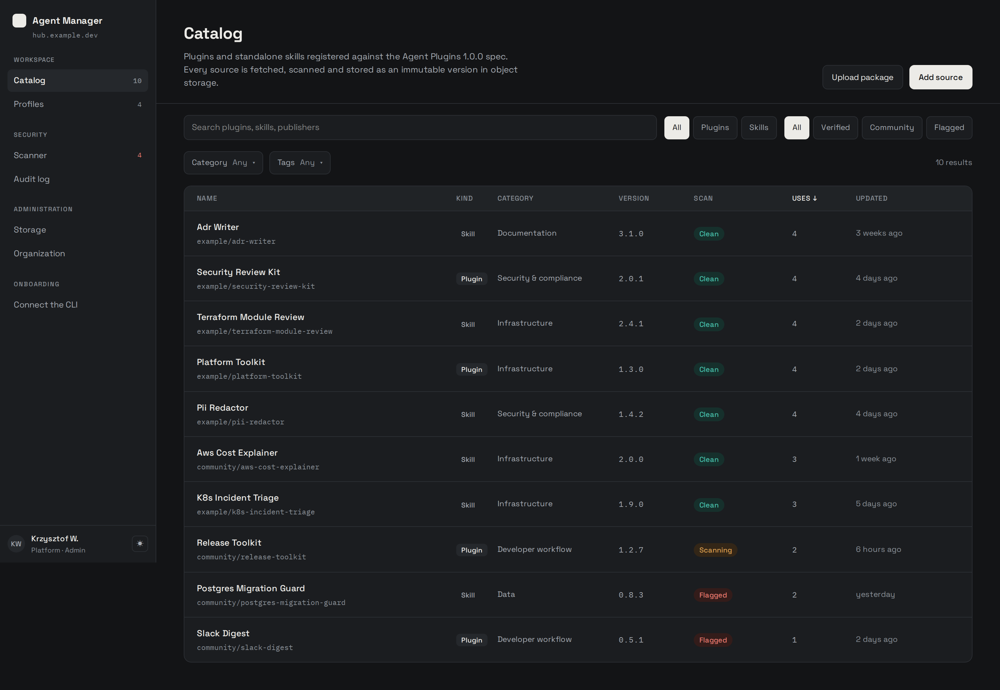
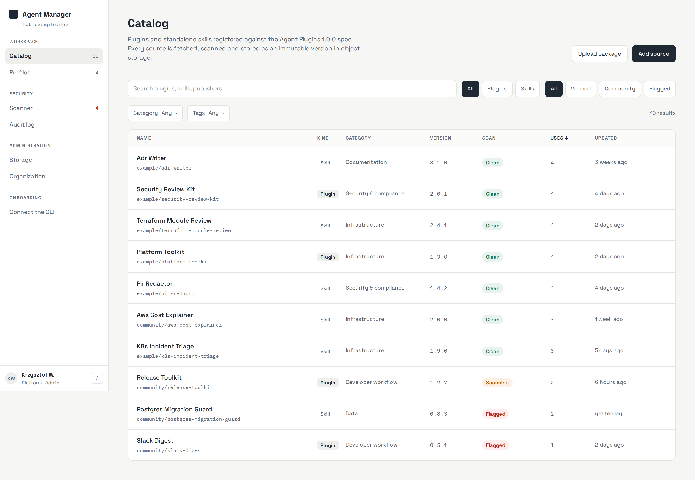
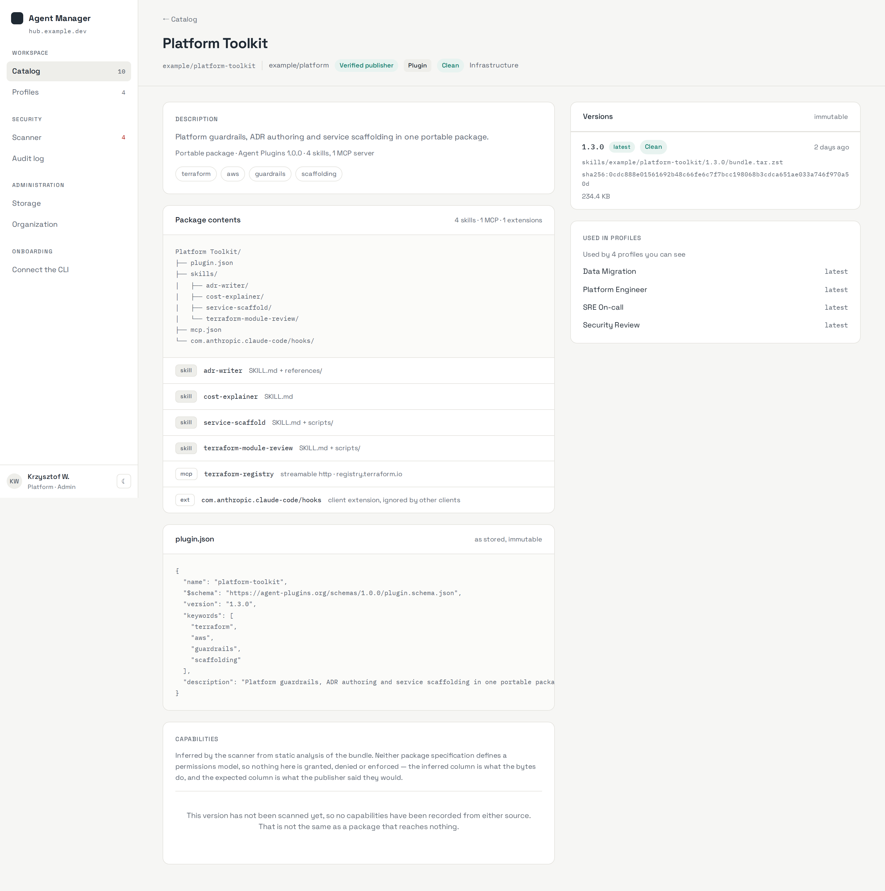
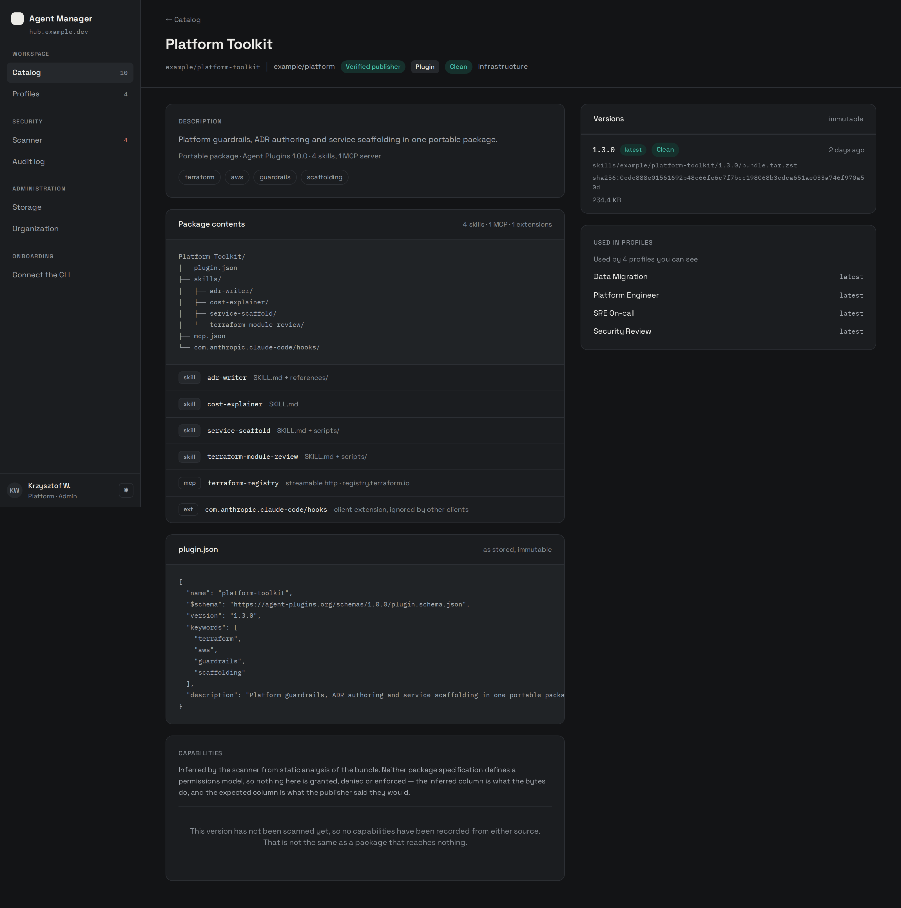
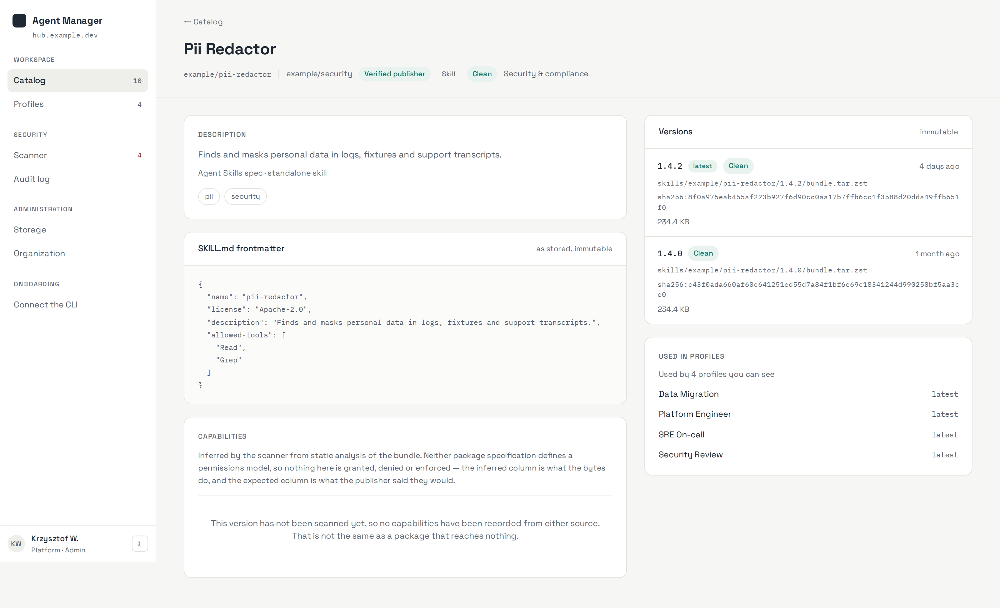
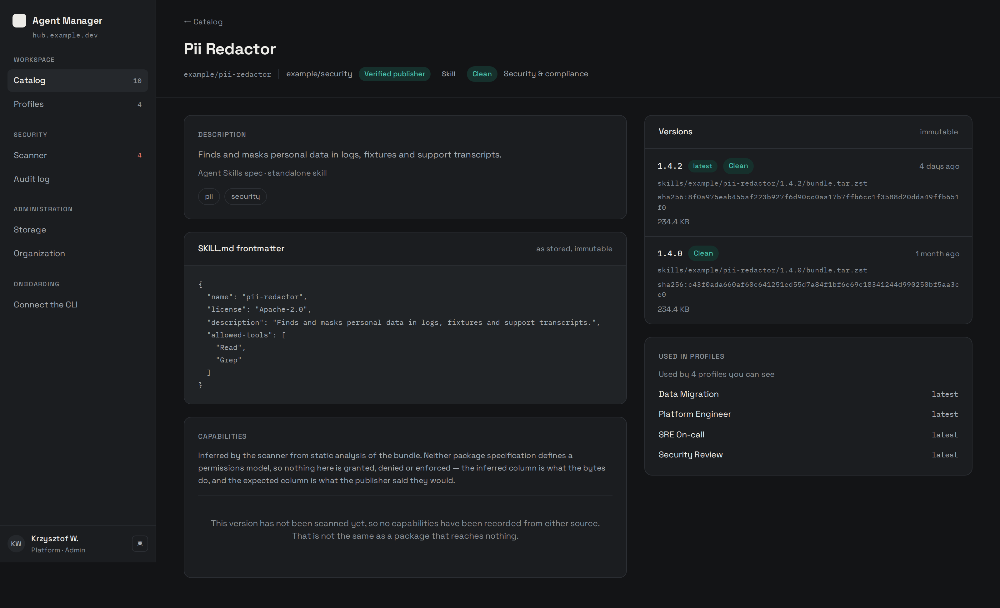

<div align="center">

# Agent Manager

**A governed registry for the AI skills and plugins your organisation actually runs.**

Register a package once. The hub fetches the bytes, freezes them under a digest, analyses
what they reach, and hands a machine a lockfile that pins exact versions — so nothing
arrives that nobody looked at.

[](https://github.com/WindKube/agent-manager/actions/workflows/ci.yaml)
[](https://github.com/WindKube/agent-manager/actions/workflows/security.yaml)
[](https://github.com/WindKube/agent-manager/actions/workflows/lint-workflows.yaml)
[](go.mod)
[](Taskfile.openapi.yaml)
[](LICENSE)

</div>

<br>



<br>

## What it is

Teams are installing agent skills and plugins from wherever they find them. Each one is a
bundle of prose an agent will follow and shell scripts an agent may run, and most
organisations have no idea which ones are on which machine.

Agent Manager is the hub in between. A package is registered from an upload, a git
repository or an archive URL; the bytes are fetched once, frozen under a digest, analysed
for what they reach, and only then made resolvable. People assemble **profiles** — named
sets of packages — and a machine syncs a profile into a lockfile that pins exact versions by
digest.

It is one Go binary and one container image. The roles are subcommands.

It is also still being built, against a written specification, and the feature list below
says which parts are not there yet rather than leaving you to find out. [Status](#status) has
the whole picture.

## Features

**Ingestion that keeps the bytes.**
Register from an uploaded archive, a git repository at a ref and subdirectory, or an archive
URL. Every fetch goes through an SSRF-guarded client that refuses private address space, and
an extractor with hard caps on entry count, path depth, decompressed size and expansion
ratio. Path traversal, symlink escape and zip bombs are refused at the boundary, not
detected afterwards.

**Immutable versions, published last.**
A version's bytes never change. A digest is computed on write, the object key encodes
`namespace/name/semver`, and a version becomes visible only once its bytes, digest and
metadata have all landed — so a half-finished publish is invisible rather than broken.

**Static analysis, not a permission prompt.** *(the inference and the comparison are built;
the shell parser that feeds them, the rule packs and the findings review are not)*
Capabilities are inferred from what the bytes *do*, never from what the manifest claims:
hosts from commands and from URLs in instruction files, filesystem scope from read and write
targets, shell from the commands present — and a shell capability is never below `review`.
Commands reach the inference already parsed to an AST rather than pattern-matched, with
expansions left unresolved: `$HOST` stays four characters, because resolving it would mean
running the script. What the publisher *declared* is read separately, and the two are shown
side by side. Neither package specification defines a permissions model, so nothing here is
granted, denied or enforced — and the screen says exactly that, in those words.

**A catalog that filters in SQL.**
Search across name, id, publisher and tags; facets for kind, scan verdict, category and
tags; sort by usage, name or recency. Measured at 10,000 packages and 50,000 versions:
**p95 14 ms** against a 300 ms budget.

**Profiles resolved into lockfiles.** *(specified and modelled; resolution not built yet)*
A profile pins packages by `latest`, an exact version, or a semver range. Resolving it
produces a lockfile naming every entry's version, digest and object key — and every entry it
*skipped*, with the reason. A rejected version is unresolvable by any profile regardless of
gate.

**Least privilege that is structural, not documented.**
The role serving the web UI holds no database credential and no object-store credential —
its config struct has no field that could carry one, and an import-graph test fails the
build if it ever imports a datastore package. Five hand-written Postgres roles and two MinIO
users divide the rest. A compiled test asserts each refusal against a live Postgres by
SQLSTATE, not by "an error happened".

**An audit row per state change, written in the same transaction.**
Append-only, naming the actor, whether that actor was a person or a worker, and what
happened. It is not a log: a registration that rolls back leaves no audit row, and one that
commits cannot fail to.

## Screens

Both themes are first-class. The theme is decided server-side from a cookie, so the very
first byte of HTML already carries it and there is no flash of the wrong one, and both pass
WCAG AA contrast on text and interactive controls — asserted by a test that parses the
stylesheet, not by eye.

**Catalog** — every registered package. Search, four facets and the sort all resolve to one
SQL statement plus one for the facet counts; nothing is filtered in Go.

| Light | Dark |
|---|---|
| [](docs/img/catalog-light.png) | [](docs/img/catalog-dark.png) |

**Package detail, plugin variant** — the contents tree derived from the component rows, the
manifest exactly as it was stored, the version history with each full object key and digest,
and the capability panel in its honest pre-scan state.

| Light | Dark |
|---|---|
| [](docs/img/package-detail-light.png) | [](docs/img/package-detail-dark.png) |

**Package detail, skill variant** — structurally a different page, not the same page with
empty sections: no contents tree at all, `SKILL.md` frontmatter in place of `plugin.json`,
and an origin line that reads `standalone skill` or names the plugin the skill is
distributed inside.

| Light | Dark |
|---|---|
| [](docs/img/package-skill-light.png) | [](docs/img/package-skill-dark.png) |

Every screenshot is captured from the running stack — the real web role, talking to the real
API over HTTP, over a seeded Postgres. None of them is a mock or a design comp.

## How it fits together

One binary, one image, roles as subcommands:

```
agent-manager serve api          the HTTP API — Postgres and the bucket, no browser
agent-manager serve web          the UI — no datastore credential of any kind
agent-manager worker run fetcher fetch, extract, digest, store, publish
agent-manager migrate queue      the job queue's own database
```

A publish writes its rows, its job and its audit entry in **one transaction** through an
outbox, so a job can never commit without the row it works on. The queue lives in a separate
database from the application, which is why that guarantee is available at all.

The OpenAPI 3.1 document is **emitted from the operation definitions** and never
hand-maintained; the typed client the web role uses is generated from it, and CI fails on a
breaking change against the merge base.

## Quickstart

```bash
task up
```

That brings up Postgres, MinIO, the identity provider, the migrations, the API, the web
UI and the fetcher. The UI is on <http://localhost:8080> and the API on <http://localhost:8082>.

Requires Docker and [Task](https://taskfile.dev). Nothing else is installed on the host —
the toolchain is pinned in `mise.toml`, and the image has no Node.js in it.

## Status

Being built against a written specification, layer by layer. Working today: ingestion from
all three sources, the fetch pipeline, immutable storage, the catalog, and the package detail
screen with capability comparison. In progress: the scanner's rule packs and findings review,
profiles and lockfile resolution, the device flow for pairing a machine, and the
organisation, storage and audit screens — those routes render a placeholder for now.

## Acknowledgements

This project is assembled almost entirely from other people's work. What each piece does *here*:

### Go modules

| Module | Version | What it does in this project |
| --- | --- | --- |
| [`ariga.io/atlas-provider-bun`](https://ariga.io/atlas-provider-bun) | `v0.0.3` | Reads the Bun models to produce the desired schema state Atlas diffs against |
| [`github.com/Masterminds/semver`](https://github.com/Masterminds/semver) | `v3.5.0` | Semver parsing and range matching — `latest`, a pinned version and a `range` pin are all decided here |
| [`github.com/a-h/templ`](https://github.com/a-h/templ) | `v0.3.1020` | Typed HTML components, compiled to Go |
| [`github.com/caarlos0/env`](https://github.com/caarlos0/env) | `v11.4.1` | Per-role config from `AGENT_MANAGER_*` — one struct per role, which is how the credential boundary is expressed in Go |
| [`github.com/coreos/go-oidc`](https://github.com/coreos/go-oidc) | `v3.20.0` | OIDC discovery and token verification against the organisation's identity provider |
| [`github.com/danielgtaylor/huma`](https://github.com/danielgtaylor/huma) | `v2.39.1` | OpenAPI 3.1 emitted *from* the operation definitions — the served document is generated, never hand-maintained |
| [`github.com/gin-gonic/gin`](https://github.com/gin-gonic/gin) | `v1.12.0` | HTTP routing for both the api and web roles |
| [`github.com/golang-jwt/jwt`](https://github.com/golang-jwt/jwt) | `v5.3.1` | Signing and verifying the hub's own short-lived tokens |
| [`github.com/google/go-github`](https://github.com/google/go-github) | `v90.0.0` | The GitHub API for the git registration source: resolving a ref and downloading a tarball without shelling out to `git` |
| [`github.com/google/uuid`](https://github.com/google/uuid) | `v1.6.0` | UUIDv7 primary keys, so insertion order and index locality come free |
| [`github.com/jackc/pgx`](https://github.com/jackc/pgx) | `v5.10.0` | Postgres driver and connection pooling; the two pools (app, queue) are two `pgxpool.Pool`s on two databases |
| [`github.com/klauspost/compress`](https://github.com/klauspost/compress) | `v1.19.2` | zstd for `bundle.tar.zst` — the archive format every version is stored as |
| [`github.com/oapi-codegen/oapi-codegen`](https://github.com/oapi-codegen/oapi-codegen) | `v2.8.0` | The typed client the web role uses to reach the api — its only door to data |
| [`github.com/oapi-codegen/runtime`](https://github.com/oapi-codegen/runtime) | `v1.7.0` | Required by the generated client: oapi-codegen emits calls into it for path-parameter styling |
| [`github.com/riverqueue/river`](https://github.com/riverqueue/river) | `v0.45.0` | Durable job queue, on its own database by construction |
| [`github.com/rs/zerolog`](https://github.com/rs/zerolog) | `v1.35.1` | Structured logging with the correlation id carried through the context |
| [`github.com/santhosh-tekuri/jsonschema`](https://github.com/santhosh-tekuri/jsonschema) | `v6.0.2` | JSON Schema validation of skill and plugin manifests against the vendored Agent Skills schemas |
| [`github.com/spf13/cobra`](https://github.com/spf13/cobra) | `v1.10.2` | The role tree: one binary, roles as subcommands (`serve api`, `worker run`, `migrate queue`) |
| [`github.com/starfederation/datastar-go`](https://github.com/starfederation/datastar-go) | `v1.2.2` | Hypermedia interactivity over SSE, so the UI needs no SPA framework |
| [`github.com/stretchr/testify`](https://github.com/stretchr/testify) | `v1.12.1` | Assertions throughout the test suite |
| [`github.com/testcontainers/testcontainers-go`](https://github.com/testcontainers/testcontainers-go) | `v0.44.0` | A real Postgres for the integration suite, so grants and constraints are asserted against a database rather than a mock |
| [`github.com/uptrace/bun`](https://github.com/uptrace/bun) | `v1.2.18` | The models that are the schema's source of truth, and the query builder above pgx |
| [`gocloud.dev`](https://gocloud.dev) | `v0.46.0` | Blob storage behind one interface — S3/MinIO in production, in-memory in tests |
| [`golang.org/x/tools`](https://golang.org/x/tools) | `v0.49.0` | `go/packages` for the import-graph test that enforces the role boundaries |
| [`gopkg.in/yaml.v3`](https://gopkg.in/yaml.v3) | `v3.0.1` | Parses the frozen contract in the test that proves the emitted OpenAPI document is still a superset of it |

### Infrastructure

| | |
| --- | --- |
| **PostgreSQL** | Both databases: the application schema with its outbox, and River's queue |
| **Atlas (community)** | Versioned migrations with a checksummed directory, so a tampered migration set fails to apply |
| **MinIO** | S3-compatible object storage for bundle bytes in local development |
| **Dex + glauth** | OIDC provider for local development, including the RFC 8628 device grant. glauth is the directory behind it, and it is there because the `groups` claim the hub maps to roles cannot come from a static password list |
| **Tailwind CSS** | Styling via the standalone binary — no Node.js in any image |
| **Redoc** | The static, self-contained API reference built by `task openapi:docs` |
| **Distroless** | The runtime base image: no shell, no package manager, non-root |

### Tooling

| | |
| --- | --- |
| **vacuum** | OpenAPI linting and the quality score reported in CI |
| **Spectral** | A second OpenAPI ruleset — it is the one that lints the external `$ref`ed schema |
| **Redocly CLI** | Docs, bundling, and the linter that caught a YAML flow-mapping defect the other two missed |
| **openapi-changes** | Diffs the contract against the merge base and fails the build on a breaking change |
| **wiretap** | Mocks the contract, and proxies a running api to validate every request and response against it |
| **golangci-lint** | Go linting |
| **govulncheck** | Vulnerability scanning against the Go vulnerability database |
| **zizmor** | GitHub Actions supply-chain auditing — it found unpinned actions and an over-broad permission |
| **gitleaks / TruffleHog** | Secret scanning: staged diff locally, full history with verification in CI |
| **actionlint** | Workflow syntax and expression checking |
| **pre-commit** | Runs the whole set locally, so CI is not the first place a failure appears |
| **Task** | The task runner; `Taskfile.openapi.yaml` also works standalone |
| **mise** | Pins the dev toolchain — `mise install` is the whole bootstrap |

### Specifications

| | |
| --- | --- |
| **Agent Plugins specification** | The `plugin.json` and skill layout this hub validates against. Spec text CC-BY-4.0, reference code Apache-2.0. |
| **RFC 8628** | OAuth 2.0 Device Authorization Grant — the flow the CLI uses to authenticate. |
| **RFC 9457** | Problem Details for HTTP APIs — the shape wiretap returns on a contract violation. |
| **Semantic Versioning 2.0.0** | Version precedence, including prerelease ordering, which `semver_sort` encodes as a collatable key. |

_Every direct requirement in `go.mod` appears above, plus 149 indirect modules not listed individually._

## Licence

[Apache-2.0](LICENSE).
